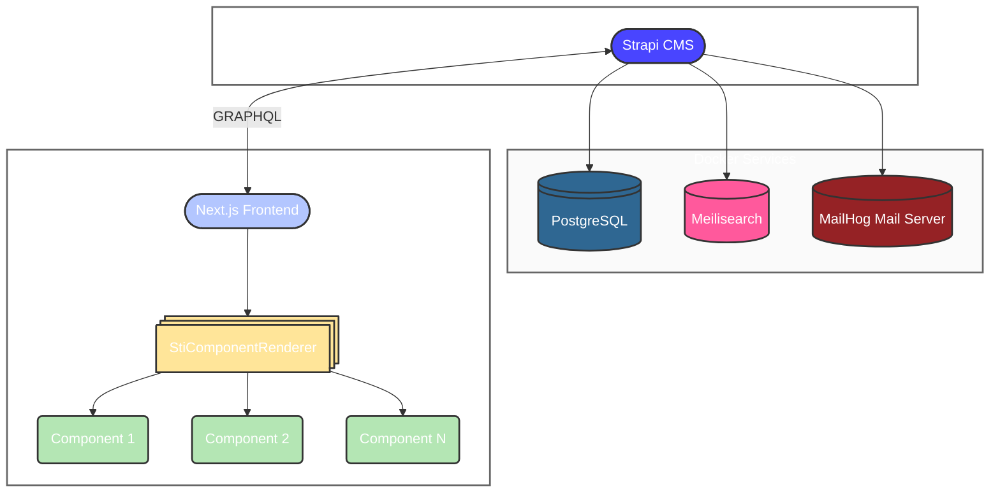

# 📖 Blog Starter — Next.js + Strapi

This project is an open-source blog platform built with Next.js (Page Router) on the frontend and Strapi as the headless CMS.

Its goal is to provide a clean, modern and fully customizable foundation that anyone can clone and extend for their own blog or content-driven website.

## Features

- 📝 **Strapi Headless CMS** for content management
- 🗂️ **Content types** for blog posts, categories, tags and other
- 🧩 **Dynamic component rendering** based on Strapi content structure
- ⚛️ **Next.js** frontend for fast and SEO-friendly rendering
- 🎨 **Tailwind CSS** for styling
- 📦 **Modular architecture** for easy customization
- ⚙️ **Justfile** for task automation
- 🐳 **Docker** support for easy deployment

## Tech Stack

- **Frontend**: Next.js (Page Router), TypeScript
- **Backend (CMS)**: Strapi
- **Styles**: Tailwind CSS
- **Database**: PostgreSQL (Dockerized)

## Architecture Overview

The project is structured into two main directories:

- `/cms`: Contains the Strapi backend code, including content types, configurations, and customizations.

- `/frontend`: Contains the Next.js frontend code, including pages, components, styles, and
API integrations.

Each section of the homepage or pages is defined in Strapi as dynamic components.
The frontend loops through them and renders the matching React component:

### 1. Dynamic Component Renderer

```jsx
{home.content.map((component, index) => (
  <StiComponentRenderer key={index} type={component.__component} config={component} />
))}
```

### 2. Service Layer

All requests to Strapi are isolated in /services/*.ts:

```typescript
class PostService {
  private readonly API_URL = process.env.API_URL || "http://localhost:1337";
  private readonly STRAPI_API_TOKEN = process.env.STRAPI_API_TOKEN;

  async getPosts() {
    const res = await fetch(`${this.API_URL}/api/posts?populate=*`, {
      headers: {
        Authorization: `Bearer ${this.STRAPI_API_TOKEN}`,
      },
      next: { revalidate: 60 },
    });

    if (!res.ok) throw new Error("Failed to fetch posts");

    const data = await res.json();
    return data;
  }

  ... // Other methods like getPostBySlug, getCategories, etc.
}

export const postService = new PostService();
```

## Example Article Included

**Title**: Using WebSockets in Next.js  
**Excerpt**:
“Learn how to add real-time features to your Next.js app using WebSockets, from establishing the connection to handling live data updates efficiently.”

**Category**: Real-time Development  
**Tags**: Next.js, WebSockets, Real-time, JavaScript

## Requirements

- Node.js v14 or higher
- npm v6 or higher
- Docker
- Just command runner

## Getting Started

1. Install dependencies for both backend and frontend:

    ```bash
    just install
    ```

2. Create a `.env` file in both `/cms` and `/frontend` directories based on the provided `.env.example` files.


### Running the Project Locally

1. Start the Docker containers for the database:

    ```bash
    just docker-up
    ```

2. Start the Strapi CMS development server:

    ```bash
    just start-cms
    ```

3. Start the Next.js frontend development server:

    ```bash
    just start-frontend
    ```

4. Open your browser and navigate to `http://localhost:3000` to view the blog.
5. Open another tab and navigate to `http://localhost:1337/admin` to access the Strapi admin panel.

## Deployment

1. Export the database from your local environment.

    ```bash
    just cms-export-data /path/to/export
    ```

2. Import the database to your production environment.

    ```bash
    just cms-import-data /path/to/import
    ```

## Development Notes

- The project is structured to avoid redundant API calls.
- Services are cached and optimized for SSR.
- Components remain clean and focused on rendering.
- Easy to expand with new components via Strapi dynamic zones.

## Architecture Diagram



## License

This project is licensed under the MIT License. See the [LICENSE](LICENSE) file for details.
